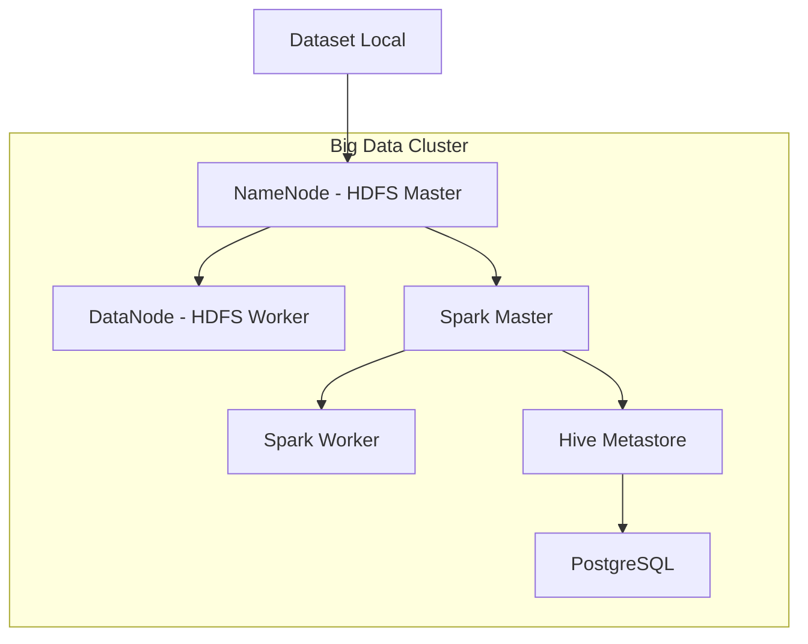

# Panduan Lengkap: Setup Docker untuk Big Data Analytics Pipeline

---

## 🖥️ Requirement Sistem

### Hardware Requirements

| Component | Minimum | Recommended |
|-----------|---------|-------------|
| **RAM** | 8GB | 16GB |
| **CPU** | 4 cores | 8 cores |
| **Storage** | 20GB free | 50GB free |
| **OS** | Windows 10/11, Linux, macOS | - |

### Software Requirements

- Docker Engine 20.10+
- Docker Compose 2.0+
- Git
- Web Browser (untuk Web UI)

---

## 🚀 Persiapan Environment

### 1. Install Docker & Docker Compose

#### **Windows (Docker Desktop)**
```bash
# Download dari https://www.docker.com/products/docker-desktop
# Install dan restart sistem

# Verifikasi instalasi
docker --version
docker-compose --version
```

#### **Linux (Ubuntu/Debian)**
```bash
# Update package index
sudo apt-get update

# Install Docker
sudo apt-get install -y docker.io docker-compose

# Add user ke docker group
sudo usermod -aG docker $USER
newgrp docker

# Verifikasi
docker --version
docker-compose --version
```

#### **macOS (Homebrew)**
```bash
# Install via Homebrew
brew install docker docker-compose

# Verifikasi
docker --version
docker-compose --version
```

### 2. Verifikasi Docker Installation
```bash
# Test Docker
docker run hello-world

# Check Docker info
docker info

# Check available resources
docker system df
```

---

---

## ⚙️ Konfigurasi Kontainer

### 1. Arsitektur Sistem



### 2. Services Overview

| Service | Port | Description | Web UI |
|---------|------|-------------|---------|
| **NameNode** | 9000, 9870 | HDFS Master Node | http://localhost:9870 |
| **DataNode** | 9864 | HDFS Data Storage | http://localhost:9864 |
| **Spark Master** | 7077, 8080 | Spark Cluster Manager | http://localhost:8080 |
| **Spark Worker** | - | Spark Executor | - |
| **Hive Metastore** | 9083 | Metadata Service | - |
| **PostgreSQL** | 5432 | Metastore Database | - |

## 🔧 Build dan Deploy

### 1. Pre-Build Checklist

```bash
# Verifikasi file konfigurasi ada
ls -la docker/
# Output harus ada:
# - docker-compose.yml
# - Dockerfile.namenode
# - Dockerfile.datanode

# Verifikasi dataset tersedia
ls -la dataset/bronze/bmkg/
ls -la dataset/bronze/bps/

# Verifikasi scripts tersedia
ls -la scripts/
```

### 2. Build Containers

```bash
# Masuk ke direktori docker
cd docker

# Build semua containers sekaligus
echo "🔨 Building all containers..."
docker-compose build

# Alternatif: Build dengan no-cache untuk memastikan update terbaru
echo "🔨 Building all containers (fresh build)..."
docker-compose build --no-cache

# Verifikasi images berhasil dibuild
docker images | grep -E "(namenode|datanode)"

# Check build summary
echo "✅ Build completed. Available images:"
docker-compose images
```

### 3. Build Options (Optional)

```bash
# Build specific service jika diperlukan
docker-compose build namenode
docker-compose build datanode

# Build dengan progress output
docker-compose build --progress=plain

# Build parallel (default)
docker-compose build --parallel

# Build dengan custom memory limit
docker-compose build --memory=2g
```

### 4. Deploy Cluster

```bash
# Start semua services
echo "🚀 Starting Big Data Cluster..."
docker-compose up -d

# Monitor startup progress
echo "⏳ Waiting for services to initialize..."
sleep 60

# Check container status
docker-compose ps
```

### 5. Expected Output

Setelah deploy berhasil, Anda harus melihat:

```bash
docker-compose ps
#     Name                   Command               State                    Ports                  
# ------------------------------------------------------------------------------------------------
# datanode              /bin/bash /opt/hadoop/sta ...   Up      0.0.0.0:9864->9864/tcp           
# hive-metastore         /entrypoint.sh /opt/hive/ ...   Up      0.0.0.0:9083->9083/tcp           
# hive-metastore-postgresql   docker-entrypoint.sh postgres   Up      0.0.0.0:5432->5432/tcp           
# namenode              /bin/bash /opt/hadoop/sta ...   Up      0.0.0.0:9000->9000/tcp, 0.0.0.0:9870->9870/tcp
# spark                 /opt/bitnami/scripts/spar ...   Up      0.0.0.0:4040->4040/tcp, 0.0.0.0:7077->7077/tcp, 0.0.0.0:8080->8080/tcp
# spark-worker          /opt/bitnami/scripts/spar ...   Up      
```

---

## ✅ Verifikasi Setup

### 1. Test Containers Health

```bash
# Test semua containers running
docker ps --format "table {{.Names}}\t{{.Status}}\t{{.Ports}}"

# Test container logs
docker logs namenode | tail -10
docker logs datanode | tail -10
docker logs spark | tail -10
```

### 2. Test HDFS Connectivity

```bash
# Test HDFS commands
echo "🧪 Testing HDFS..."
docker exec -it namenode hdfs dfsadmin -report

# Create test directory
docker exec -it namenode hdfs dfs -mkdir -p /test
docker exec -it namenode hdfs dfs -ls /
docker exec -it namenode hdfs dfs -rm -r /test

echo "✅ HDFS Test Passed"
```

### 3. Test Spark Connectivity

```bash
# Test Spark Master
echo "🧪 Testing Spark..."
docker exec -it spark spark-shell --version

# Test PySpark
docker exec -it spark python -c "
import pyspark
from pyspark.sql import SparkSession
spark = SparkSession.builder.appName('Test').getOrCreate()
print('✅ PySpark Test Passed')
spark.stop()
"
```

### 4. Test Network Connectivity

```bash
# Test inter-container communication
echo "🧪 Testing Network..."
docker exec -it spark ping -c 3 namenode
docker exec -it datanode ping -c 3 namenode
docker exec -it spark ping -c 3 datanode

echo "✅ Network Test Passed"
```

### 5. Test Web UIs

Buka browser dan akses:

| Service | URL | Expected |
|---------|-----|----------|
| **NameNode** | http://localhost:9870 | HDFS Overview |
| **Spark Master** | http://localhost:8080 | Spark Cluster Info |
| **DataNode** | http://localhost:9864 | DataNode Info |

---

## 📊 Monitoring

### 1. Resource Monitoring

```bash
# Monitor real-time resource usage
docker stats

# Monitor specific container
docker stats namenode spark

# Check disk usage
docker system df
```

### 2. Log Monitoring

```bash
# Monitor logs real-time
docker-compose logs -f

# Monitor specific service
docker-compose logs -f namenode
docker-compose logs -f spark

# Check error logs
docker-compose logs | grep -i error
```

### 3. Health Checks

```bash
# Custom health check script
cat > health_check.sh << 'EOF'
#!/bin/bash
echo "🔍 Cluster Health Check"
echo "======================="

# Check containers
echo "📦 Container Status:"
docker-compose ps

# Check HDFS
echo -e "\n💾 HDFS Status:"
docker exec -it namenode hdfs dfsadmin -report | grep -E "(Live datanodes|Dead datanodes)"

# Check Spark
echo -e "\n⚡ Spark Status:"
docker exec -it spark curl -s http://localhost:8080 > /dev/null && echo "✅ Spark Master OK" || echo "❌ Spark Master DOWN"

# Check Web UIs
echo -e "\n🌐 Web UI Status:"
curl -s http://localhost:9870 > /dev/null && echo "✅ NameNode UI OK" || echo "❌ NameNode UI DOWN"
curl -s http://localhost:8080 > /dev/null && echo "✅ Spark UI OK" || echo "❌ Spark UI DOWN"

echo -e "\n✅ Health Check Complete"
EOF

chmod +x health_check.sh
./health_check.sh
```

---

## 🚀 Next Steps

Setelah setup berhasil, lanjutkan ke tahap berikutnya:

1. **Data Ingestion**: Jalankan `ingest_data.py`
2. **Data Processing**: Jalankan `bronze_to_silver.py`
3. **Feature Engineering**: Jalankan pipeline silver to gold
4. **Model Training**: Jalankan model machine learning
5. **Evaluation**: Analisis hasil model