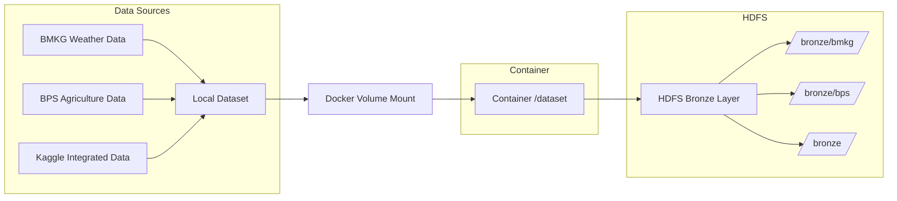

# Data Ingestion - Bronze Layer

## Overview

Tahap data ingestion adalah proses pertama dalam pipeline data lakehouse yang bertujuan untuk memindahkan data mentah dari local storage ke HDFS (Hadoop Distributed File System) sebagai bronze layer. Tahap ini memproses tiga sumber data utama: data cuaca BMKG, data pertanian BPS, dan dataset terintegrasi dari Kaggle.

## Arsitektur Data Flow



---

## Data Sources

### 1. BMKG Weather Data (Raw)
- **Source**: [Badan Meteorologi, Klimatologi, dan Geofisika](https://dataonline.bmkg.go.id/)
- **Format**: Separate CSV files per province
- **Content**: Daily weather measurements (temperature, humidity, rainfall, etc.)
- **Coverage**: 10 provinces in Sumatera
- **Time Period**: 2023 (daily data)

### 2. BPS Agriculture Data (Raw)
- **Source**: [Badan Pusat Statistik](https://www.bps.go.id/id/statistics-table/2/MTQ5OCMy/luas-panen-produksi-dan-produktivitas-padi-menurut-provinsi.html) 
- **Format**: Single CSV file
- **Content**: Annual harvest area, production, and productivity
- **Coverage**: National/provincial level
- **Time Period**: 2023 (annual data)

### 3. **Kaggle Integrated Dataset (Clean)**
- **Source**: [Kaggle - Dataset Tanaman Padi Sumatera, Indonesia](https://www.kaggle.com/datasets/ardikasatria/datasettanamanpadisumatera)
- **File**: `Data_Tanaman_Padi_Sumatera.csv`
- **Format**: Single integrated CSV file
- **Content**: Historical rice production with weather factors
- **Coverage**: 8 provinces in Sumatera
- **Time Period**: 1993-2020 (27 years of historical data)

## Implementasi

### 1. Script Ingest Data (`ingest_data.sh`)

Script bash ini bertanggung jawab untuk mengupload file CSV dataset ke HDFS dengan struktur direktori yang terorganisir.

```bash
#!/bin/bash

DATASET_DIR="/dataset/bronze"
HDFS_DIR="/bronze"
```

#### Konfigurasi Path

| Variable | Path | Description |
|----------|------|-------------|
| **DATASET_DIR** | `/dataset/bronze` | Volume mount dari host ke container |
| **HDFS_DIR** | `/bronze` | Target directory di HDFS |

> **Note**: Path `/dataset/bronze` adalah hasil mount dari docker-compose.yml:
> ```yaml
> volumes:
>   - ../dataset:/dataset
> ```

---

### 2. Fungsi Utama

#### Validasi Dataset

```bash
# Verify dataset structure
if [ ! -d "$DATASET_DIR/bmkg" ] || [ ! -d "$DATASET_DIR/bps" ]; then
    echo "Error: Expected subdirectories 'bmkg' and 'bps' not found in $DATASET_DIR"
    echo "Current directory structure:"
    ls -la $DATASET_DIR
    exit 1
fi
```

**Validasi yang dilakukan:**
- ✅ Memverifikasi direktori `bmkg/` tersedia
- ✅ Memverifikasi direktori `bps/` tersedia
- ✅ Mengecek keberadaan file Kaggle `Data_Tanaman_Padi_Sumatera.csv`
- ✅ Menampilkan struktur direktori jika ada error

---

#### Pembuatan Direktori HDFS

```bash
# Create HDFS directories
echo "Creating HDFS directories..."
hdfs dfs -mkdir -p $HDFS_DIR/bmkg $HDFS_DIR/bps
```

**Struktur direktori yang dibuat:**
```
/bronze/
├── bmkg/     # Data cuaca/iklim dari BMKG
├── bps/      # Data hasil panen dan luas lahan dari BPS
└── Data_Tanaman_Padi_Sumatera.csv      # Kaggle Integrated Dataset
```

--- 

#### Processing File CSV

```bash
# Count and process files
total=0
success=0

echo "Processing CSV files..."
for csv_file in $(find $DATASET_DIR -name "*.csv"); do
    total=$((total + 1))
    filename=$(basename "$csv_file")
    
    # Get relative path for HDFS
    rel_path=${csv_file#$DATASET_DIR/}
    hdfs_path="$HDFS_DIR/$rel_path"
    
    echo "Processing: $filename"
    echo "  From: $csv_file"
    echo "  To: $hdfs_path"
    
    # Upload to HDFS
    if hdfs dfs -put -f "$csv_file" "$hdfs_path" 2>/dev/null; then
        echo "  SUCCESS: Uploaded to HDFS"
        success=$((success + 1))
    else
        echo "  ERROR: Failed to upload"
    fi
done

```

**Fitur utama processing:**

1. **Dynamic File Discovery**: 
   - Menggunakan `find $DATASET_DIR -name "*.csv"` untuk mencari semua file CSV
   - Tidak hardcode nama file atau direktori spesifik
   - Otomatis detect file baru yang ditambahkan

2. **Path Calculation**:
   - `rel_path=${csv_file#$DATASET_DIR/}` - menghitung relative path
   - `hdfs_path="$HDFS_DIR/$rel_path"` - membangun HDFS target path
   - Mempertahankan struktur direktori original

3. **Upload Process**:
   - `hdfs dfs -put -f` - force overwrite jika file sudah ada
   - `2>/dev/null` - suppress error output untuk clean logging
   - Real-time feedback untuk setiap file

4. **Counter Variables**:
   - `total` - menghitung total file yang diproses
   - `success` - menghitung file yang berhasil diupload

#### Summary dan Verifikasi

```bash
# Summary
echo ""
echo "SUMMARY:"
echo "  Dataset directory used: $DATASET_DIR"
echo "  Total files: $total"
echo "  Successful: $success"
echo "  Failed: $((total - success))"

# List HDFS contents
if [ $success -gt 0 ]; then
    echo ""
    echo "HDFS Contents:"
    hdfs dfs -ls -R $HDFS_DIR
fi

echo "Data ingestion completed"
```

**Summary yang diberikan:**
- ✅ Dataset directory yang digunakan
- ✅ Total file yang diproses
- ✅ Jumlah file berhasil diupload
- ✅ Jumlah file yang gagal (calculated)
- ✅ Listing complete HDFS structure (jika ada file berhasil)

### 3. Cara Penggunaan

#### Persiapan Environment

```bash
# 1. Pastikan containers sudah running
cd docker
docker-compose ps

# 2. Verifikasi dataset tersedia di volume mount
docker exec -it namenode ls -la /dataset/bronze/
docker exec -it namenode ls -la /dataset/bronze/bmkg/
docker exec -it namenode ls -la /dataset/bronze/bps/

# 3. Verifikasi script tersedia
docker exec -it namenode ls -la /scripts/1_data_ingestion/
```

#### Eksekusi Script

```bash
# Jalankan script ingest data
docker exec -it namenode bash /scripts/1_data_ingestion/ingest_data.sh
```

#### Verifikasi Hasil

```bash
# Cek struktur HDFS
docker exec -it namenode hdfs dfs -ls -R /bronze

# Cek jumlah file dan direktori
docker exec -it namenode hdfs dfs -count /bronze

# Cek ukuran total data
docker exec -it namenode hdfs dfs -du -h /bronze

# Sample data check
docker exec -it namenode hdfs dfs -cat /bronze/bmkg/aceh.csv | head -5
```

### 4. Struktur Data Hasil

Setelah ingestion berhasil, struktur data di HDFS akan menjadi:

```
/bronze/
├── bmkg/
│   ├── aceh.csv
│   ├── babel.csv
│   ├── bengkulu.csv
│   ├── jambi.csv
│   ├── kepri.csv
│   ├── lampung.csv
│   ├── riau.csv
│   ├── sumbar.csv
│   ├── sumsel.csv
│   └── sumut.csv
├── bps/
│   └── Luas_Panen_Produksi_dan_Produktivitas_Padi_2023.csv
└── Data_Tanaman_Padi_Sumatera.csv

```

> **Note**: Script akan memproses semua file `.csv` yang ditemukan dalam direktori dataset, sehingga jika ada file tambahan, akan otomatis ter-upload.

### 5. Error Handling & Troubleshooting

#### Common Issues

| Error | Cause | Solution |
|-------|-------|----------|
| **Directory not found** | Dataset tidak ter-mount | Cek docker-compose volumes |
| **No CSV files found** | Dataset kosong atau wrong path | Verifikasi isi `/dataset/bronze/` |
| **Permission denied** | HDFS permission issue | Set permissions: `hdfs dfs -chmod 777 /bronze` |
| **Connection refused** | NameNode tidak running | Restart: `docker-compose restart namenode` |
| **Partial failures** | Individual file issues | Check file permissions & HDFS space |

#### Debug Commands

```bash
# Test file discovery
docker exec -it namenode find /dataset/bronze -name "*.csv"

# Test manual upload
docker exec -it namenode hdfs dfs -put /dataset/bronze/bmkg/aceh.csv /test.csv
docker exec -it namenode hdfs dfs -rm /test.csv

# Check HDFS space
docker exec -it namenode hdfs dfs -df -h

# Check container resources
docker stats namenode
```

#### Recovery Commands

```bash
# Reset dan re-run
docker exec -it namenode hdfs dfs -rm -r /bronze
docker exec -it namenode bash /scripts/1_data_ingestion/ingest_data.sh

# Selective re-upload (example)
docker exec -it namenode hdfs dfs -rm /bronze/bmkg/aceh.csv
docker exec -it namenode bash /scripts/1_data_ingestion/ingest_data.sh
```

---

## 🚀 Next Steps

Setelah data ingestion selesai, data siap untuk tahap berikutnya dalam pipeline:

2. **Data Processing**: Jalankan `bronze_to_silver.py`
3. **Feature Engineering**: Jalankan pipeline silver to gold
4. **Model Training**: Jalankan model machine learning
5. **Evaluation**: Analisis hasil model

---

**Note**: Script ini adalah implementasi bronze layer dalam arsitektur Data Lakehouse menggunakan Hadoop ecosystem.
