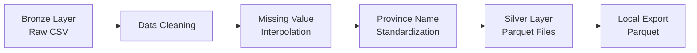

# Data Processing - Bronze to Silver Layer

## Overview
Tahap ini melakukan transformasi data dari **Bronze Layer** (raw CSV files) ke **Silver Layer** (cleaned, standardized data) dengan:
- Data cleaning dan standardisasi
- Missing value interpolation
- Province name standardization
- Data quality scoring
- Export ke format Parquet

## Architecture


## Input Data
- **BMKG Weather Data**: `hdfs://namenode:9000/bronze/bmkg/*.csv`
- **BPS Agriculture Data**: `hdfs://namenode:9000/bronze/bps/*.csv`

## Output Data
- **HDFS Silver Layer**: `hdfs://namenode:9000/silver/`
- **Local Parquet Files**: `./dataset/silver/`

---

## Implementasi

### 1. Jalankan Script Data Processing (`bronze_to_silver.py`)

```bash
# Pastikan container berjalan
docker-compose ps

# Install dependencies jika belum tersedia (error)
docker exec -it spark pip install py4j pyspark==3.5.1 pandas numpy

# Jalankan bronze to silver processing
docker exec -it spark python /scripts/2_data_processing/bronze_to_silver.py
```

---

### 2. Verifikasi Hasil di HDFS

```bash
# Check silver layer structure
docker exec -it namenode hdfs dfs -ls -R /silver

# Expected output:
# drwxr-xr-x   - root supergroup          0 2025-XX-XX XX:XX /silver/bmkg_weather_data
# drwxr-xr-x   - root supergroup          0 2025-XX-XX XX:XX /silver/bps_agriculture_data
```

---

### 3. Export Data ke Direktori Lokal

```bash
# Buat direktori output jika belum ada
mkdir -p "./dataset/silver"

# Export BMKG weather data dari HDFS ke lokal
docker exec -it namenode hdfs dfs -get /silver/bmkg_weather_data /tmp/bmkg_weather_data
docker cp namenode:/tmp/bmkg_weather_data "./dataset/silver/"

# Export BPS agriculture data dari HDFS ke lokal
docker exec -it namenode hdfs dfs -get /silver/bps_agriculture_data /tmp/bps_agriculture_data
docker cp namenode:/tmp/bps_agriculture_data "./dataset/silver/"

# Verify local files
dir ".\dataset\silver\"
```

## 📊 Data Transformations

### BMKG Weather Data Transformations

| Original Column | Transformed Column | Description |
|-----------------|-------------------|-------------|
| `STASIUN` | `stasiun` | Weather station name |
| `TANGGAL` | `tanggal` | Date (converted to date type) |
| `TN` | `temp_min` | Minimum temperature (°C) |
| `TX` | `temp_max` | Maximum temperature (°C) |
| `TAVG` | `temp_avg` | Average temperature (°C) |
| `RH_AVG` | `humidity_avg` | Average humidity (%) |
| `RR` | `rainfall` | Rainfall (mm) |
| `SS` | `sunshine_duration` | Sunshine duration (hours) |
| `FF_X` | `wind_speed_max` | Maximum wind speed (m/s) |
| `DDD_X` | `wind_dir_max` | Wind direction at max speed |
| `FF_AVG` | `wind_speed_avg` | Average wind speed (m/s) |

**Additional Columns:**
- `province`: Standardized province name (uppercase)
- `province_code`: Original province code
- `data_quality_score`: Quality score (0.5-1.0)
- `processed_at`: Processing timestamp

### BPS Agriculture Data Transformations

| Original Column | Transformed Column | Description |
|-----------------|-------------------|-------------|
| `Provinsi` | `provinsi` | Province name (uppercase) |
| `Luas Panen (ha)` | `luas_panen_ha` | Harvested area (hectares) |
| `Produktivitas (ku/ha)` | `produktivitas_ku_ha` | Productivity (quintal/hectare) |
| `Produksi (ton)` | `produksi_ton` | Production (tons) |

**Additional Columns:**
- `data_quality_score`: Quality score based on completeness
- `processed_at`: Processing timestamp

---

## 🗺️ Province Name Standardization

| BMKG Code | Standardized Name |
|-----------|-------------------|
| aceh | ACEH |
| babel | KEPULAUAN BANGKA BELITUNG |
| bengkulu | BENGKULU |
| jambi | JAMBI |
| kepri | KEPULAUAN RIAU |
| lampung | LAMPUNG |
| riau | RIAU |
| sumbar | SUMATERA BARAT |
| sumsel | SUMATERA SELATAN |
| sumut | SUMATERA UTARA |

---

## 🔧 Data Quality Features

### Missing Value Interpolation
- **Method**: Mean imputation
- **Scope**: Numeric weather columns
- **Process**: Calculate mean per column, fill nulls with mean value

### Data Quality Scoring
- **BMKG**: Based on completeness of rainfall and temperature data
- **BPS**: Based on completeness of production metrics
- **Scale**: 0.0 - 1.0 (higher = better quality)

---

## 📁 Output Structure

```
./dataset/silver/
├── bmkg_weather_data/
│   ├── part-00000-xxx.snappy.parquet
│   └── _SUCCESS
└── bps_agriculture_data/
    ├── part-00000-xxx.snappy.parquet
    └── _SUCCESS
```

---

## 🔍 Data Verification

### Verify BMKG Data

```bash
# Verify BMKG data dengan Spark
docker exec -it spark python -c "
from pyspark.sql import SparkSession
spark = SparkSession.builder.appName('VerifyBMKG').getOrCreate()

# Read from HDFS
bmkg = spark.read.parquet('hdfs://namenode:9000/silver/bmkg_weather_data')

print('=== BMKG Silver Data Summary ===')
print(f'Total records: {bmkg.count()}')
print(f'Provinces: {bmkg.select(\"province\").distinct().count()}')
print(f'Date range: {bmkg.agg({\"tanggal\": \"min\"}).collect()[0][0]} to {bmkg.agg({\"tanggal\": \"max\"}).collect()[0][0]}')

print('\n=== Missing Values Check ===')
for col_name in ['temp_min', 'temp_max', 'temp_avg', 'humidity_avg', 'rainfall']:
    null_count = bmkg.filter(bmkg[col_name].isNull()).count()
    print(f'{col_name}: {null_count} missing values')

print('\n=== Province Standardization ===')
bmkg.select('province_code', 'province').distinct().orderBy('province_code').show(truncate=False)

print('\n=== Data Quality Score ===')
bmkg.agg({'data_quality_score': 'avg'}).show()

spark.stop()
"
```

### Verify BPS Data

```bash
# Verify BPS data dengan Spark
docker exec -it spark python -c "
from pyspark.sql import SparkSession
spark = SparkSession.builder.appName('VerifyBPS').getOrCreate()

# Read from HDFS
bps = spark.read.parquet('hdfs://namenode:9000/silver/bps_agriculture_data')

print('=== BPS Silver Data Summary ===')
print(f'Total records: {bps.count()}')
bps.printSchema()

print('\n=== Sample Data ===')
bps.show(truncate=False)

print('\n=== Data Quality Score ===')
bps.agg({'data_quality_score': 'avg'}).show()

spark.stop()
"
```

### Verify Local Parquet Files

```bash
# Verify local parquet files dengan Python
python -c "
import pandas as pd

print('=== Local BMKG Parquet Verification ===')
try:
    bmkg_files = pd.read_parquet('.\dataset\silver\bmkg_weather_data')
    print(f'BMKG records: {len(bmkg_files)}')
    print(f'BMKG columns: {list(bmkg_files.columns)}')
    print(f'BMKG provinces: {bmkg_files[\"province\"].nunique()}')
except Exception as e:
    print(f'Error reading BMKG parquet: {e}')

print('\n=== Local BPS Parquet Verification ===')
try:
    bps_files = pd.read_parquet('.\dataset\silver\bps_agriculture_data')
    print(f'BPS records: {len(bps_files)}')
    print(f'BPS columns: {list(bps_files.columns)}')
    print(bps_files.head())
except Exception as e:
    print(f'Error reading BPS parquet: {e}')
"
```

---

## 🚨 Troubleshooting

### Common Issues

**1. PySpark Dependencies Missing**
```bash
# Solution: Install dependencies
docker exec -it spark pip install py4j pyspark==3.5.1 pandas numpy
```

**2. HDFS Files Not Found**
```bash
# Solution: Check bronze layer exists
docker exec -it namenode hdfs dfs -ls -R /bronze
```

**3. Permission Issues**
```bash
# Solution: Check HDFS permissions
docker exec -it namenode hdfs dfs -chmod -R 755 /bronze
docker exec -it namenode hdfs dfs -chmod -R 755 /silver
```

**4. Export to Local Fails**
```bash
# Solution: Create output directory
mkdir -p "./dataset/silver"

# Alternative: Direct copy with proper permissions
docker exec -it namenode hdfs dfs -copyToLocal /silver/bmkg_weather_data /tmp/
docker exec -it namenode chmod -R 755 /tmp/bmkg_weather_data
docker cp namenode:/tmp/bmkg_weather_data "./dataset/silver/"
```

## 🚀 Next Steps

Setelah tahap data processing berhasil, data siap untuk tahap berikutnya dalam pipeline:

3. **Feature Engineering**: Jalankan pipeline silver to gold
4. **Model Training**: Jalankan model machine learning
5. **Evaluation**: Analisis hasil model