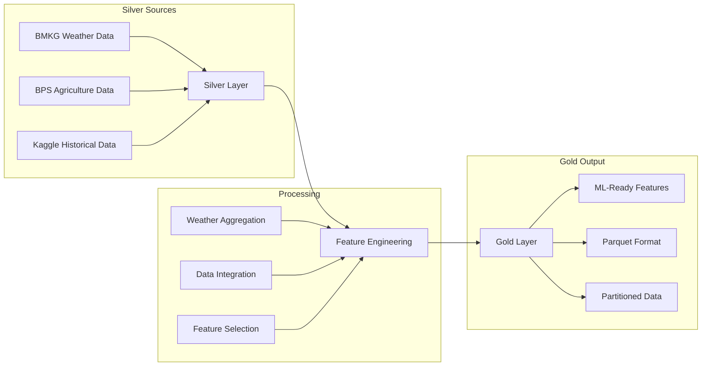

# Feature Engineering - Silver to Gold Layer

## Overview

Tahap feature engineering adalah proses transformasi data dari silver layer menjadi gold layer yang siap digunakan untuk machine learning. Tahap ini mengintegrasikan data dari berbagai sumber (BMKG, BPS, dan Kaggle) untuk menghasilkan features yang optimal untuk prediksi hasil panen padi.

## Arsitektur Data Flow



---

## Data Sources Input

### 1. Silver BMKG Weather Data
- **Path**: `hdfs://namenode:9000/silver/bmkg_weather_data`
- **Format**: Parquet
- **Content**: Cleaned daily weather measurements
- **Aggregation**: Year-over-year averages per province

### 2. Silver BPS Agriculture Data  
- **Path**: `hdfs://namenode:9000/silver/bps_agriculture_data`
- **Format**: Parquet
- **Content**: Production, harvest area, productivity data
- **Coverage**: Current year (2023)

### 3. Bronze Kaggle Historical Data
- **Path**: `hdfs://namenode:9000/bronze/Data_Tanaman_Padi_Sumatera.csv`
- **Format**: CSV
- **Content**: Historical integrated dataset (1993-2015)
- **Usage**: Primary data source for features

---

## Implementation

### 1. Script Feature Engineering (`silver_to_gold_features.py`)

```python
class SilverToGoldProcessor:
    def __init__(self):
        self.spark = SparkSession.builder \
            .appName("SilverToGoldFeatureEngineering") \
            .config("spark.sql.adaptive.enabled", "true") \
            .config("spark.sql.adaptive.coalescePartitions.enabled", "true") \
            .getOrCreate()
        
        # Paths configuration
        self.bps_path = "hdfs://namenode:9000/silver/bps_agriculture_data"
        self.bmkg_path = "hdfs://namenode:9000/silver/bmkg_weather_data"
        self.padi_csv_path = "hdfs://namenode:9000/bronze/Data_Tanaman_Padi_Sumatera.csv"
        self.gold_path = "hdfs://namenode:9000/gold/padi_features"
```

### 2. Core Functions

#### Data Loading
```python
def load_silver_data(self):
    """Load data from multiple sources"""
    # Load BPS data (silver)
    bps_df = self.spark.read.parquet(self.bps_path)
    
    # Load BMKG data (silver)
    bmkg_df = self.spark.read.parquet(self.bmkg_path)
    
    # Load Kaggle CSV data (bronze)
    padi_df = self.spark.read \
        .option("header", "true") \
        .option("inferSchema", "true") \
        .csv(self.padi_csv_path)
    
    return bps_df, bmkg_df, padi_df
```

#### Weather Feature Engineering
```python
def create_weather_features(self, bmkg_df):
    """Create aggregated weather features per province per year"""
    
    # Extract year from date
    bmkg_df = bmkg_df.withColumn("Tahun", year(col("tanggal")))
    
    # Define aggregations
    agg_exprs = [
        pyspark_round(avg("rainfall"), 2).alias("Curah_hujan"),
        pyspark_round(avg("humidity_avg"), 2).alias("Kelembapan"),
        pyspark_round(avg("temp_avg"), 2).alias("Suhu_rata_rata")
    ]
    
    # Aggregate by province and year
    weather_agg = bmkg_df.groupBy("province", "Tahun").agg(*agg_exprs)
    
    return weather_agg
```

#### Data Integration
```python
def prepare_integrated_data(self, bps_df, padi_df):
    """Integrate BPS and Kaggle data"""
    
    # Use Kaggle CSV as primary source (historical + complete)
    if "Provinsi" in padi_df.columns:
        # Standardize column names
        column_mapping = {
            "Provinsi": "province",
            "Tahun": "Tahun", 
            "Produksi": "Produksi",
            "Luas Panen": "Luas_Panen",
            "Curah hujan": "Curah_hujan",
            "Kelembapan": "Kelembapan",
            "Suhu rata-rata": "Suhu_rata_rata"
        }
        
        integrated_df = padi_df
        for old_col, new_col in column_mapping.items():
            if old_col in integrated_df.columns:
                integrated_df = integrated_df.withColumnRenamed(old_col, new_col)
    
    return integrated_df
```

#### Gold Features Creation
```python
def create_gold_features(self, integrated_df, weather_agg):
    """Create final ML-ready features"""
    
    # Check if weather data already integrated
    if all(col in integrated_df.columns for col in ["Curah_hujan", "Kelembapan", "Suhu_rata_rata"]):
        gold_df = integrated_df
    else:
        # Join with weather aggregation
        gold_df = integrated_df.join(weather_agg, on=["province", "Tahun"], how="left")
    
    # Select final columns
    required_cols = ["province", "Tahun", "Produksi", "Luas_Panen", "Curah_hujan", "Kelembapan", "Suhu_rata_rata"]
    gold_df = gold_df.select(*required_cols)
    
    # Rename for output
    gold_df = gold_df.withColumnRenamed("province", "Provinsi")
    gold_df = gold_df.orderBy("Provinsi", "Tahun")
    
    return gold_df
```

### 3. Output Schema

#### Final Gold Features

| Column | Description | Data Type | Example | ML Role |
|--------|-------------|-----------|---------|---------|
| **Provinsi** | Province name | String | "Aceh" | Categorical |
| **Tahun** | Year | Integer | 2015 | Temporal |
| **Produksi** | Rice production | Long | 1956940 | **Target Variable** |
| **Luas_Panen** | Harvest area | Long | 461060 | Feature |
| **Curah_hujan** | Annual rainfall | Double | 1575.0 | Feature |
| **Kelembapan** | Humidity percentage | Double | 80.0 | Feature |
| **Suhu_rata_rata** | Average temperature | Double | 27.1 | Feature |

---

## Cara Penggunaan

### 1. Prerequisites

```bash
# Ensure containers are running
cd docker
docker-compose ps

# Verify bronze data exists
docker exec namenode hdfs dfs -test -e /bronze/Data_Tanaman_Padi_Sumatera.csv

# Verify silver data exists (optional, script handles missing silver data)
docker exec namenode hdfs dfs -ls /silver/ 2>/dev/null
```

### 2. Execute Feature Engineering

```bash
# Run feature engineering script
docker exec spark python /scripts/3_feature_engineering/silver_to_gold_features.py
```

### 3. Verify Results

```bash
# Check HDFS gold structure
docker exec namenode hdfs dfs -ls /gold/padi_features/

# Check local export (mounted)
ls -la ../dataset/gold/padi_features/

# View sample gold data
docker exec spark python -c "
from pyspark.sql import SparkSession
spark = SparkSession.builder.appName('VerifyGold').getOrCreate()
gold_df = spark.read.parquet('hdfs://namenode:9000/gold/padi_features')
print(f'📊 Total Records: {gold_df.count()}')
print('📋 Schema:')
gold_df.printSchema()
print('📖 Sample Data:')
gold_df.show(10, truncate=False)
print('📈 Statistics:')
gold_df.describe().show()
spark.stop()
"
```

## Output Structure

### Gold Layer Directory

```
/gold/padi_features/
├── _SUCCESS                           # Success marker
└── part-00000-xxx.snappy.parquet     # Feature data

Local Mount: ../dataset/gold/padi_features/
├── _SUCCESS
└── part-00000-xxx.snappy.parquet
```

## 🚀 Next Steps

Setelah feature engineering selesai, data gold layer siap untuk:

4. **Model Training**: Jalankan model machine learning
5. **Evaluation**: Analisis hasil model

---

**Note**: Script ini mengimplementasikan feature engineering menggunakan PySpark dalam arsitektur Data Lakehouse, dengan fokus pada pembuatan features berkualitas tinggi untuk prediksi hasil panen padi.
