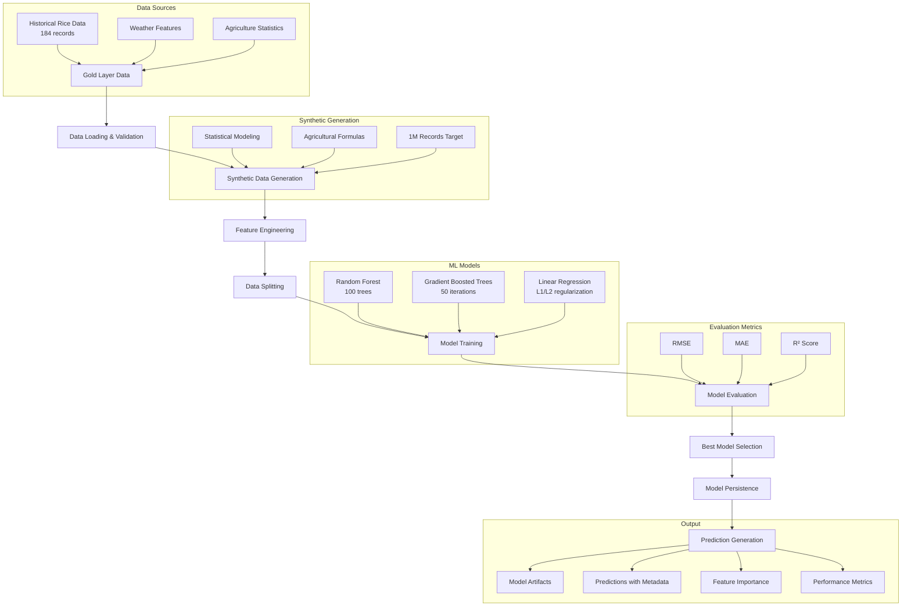

# Model Training & Evaluation - Machine Learning Pipeline

## Overview

Tahap model training dan evaluation adalah proses pembelajaran mesin untuk memprediksi produksi padi berdasarkan faktor cuaca dan lahan. Sistem ini menggunakan data dari gold layer, menghasilkan data sintetis sebanyak 1 juta record, dan melatih multiple machine learning models menggunakan Apache Spark MLlib untuk mendapatkan model prediksi terbaik.

## Arsitektur Machine Learning Pipeline



---

## Data Strategy

### 1. Input Data Sources

| Source | Path | Records | Coverage | Usage |
|--------|------|---------|----------|-------|
| **Gold Layer** | `/gold/padi_features` | 184 | 1993-2015, 8 provinces | Base patterns |
| **Synthetic Data** | Generated in-memory | 1,000,000 | 1990-2025, all provinces | Training volume |
| **Combined Dataset** | Training pipeline | 1,000,184 | Full temporal range | ML training |

### 2. Feature Schema

| Feature | Type | Range | Description | ML Role |
|---------|------|-------|-------------|---------|
| **Provinsi** | Categorical | 8 provinces | Province identifier | Geographic context |
| **Tahun** | Integer | 1990-2025 | Year | Temporal trend |
| **Luas_Panen** | Long | 10K-500K | Harvest area (hectares) | Primary predictor |
| **Curah_hujan** | Double | 800-3000 | Annual rainfall (mm) | Weather factor |
| **Kelembapan** | Double | 70-95 | Humidity percentage | Climate factor |
| **Suhu_rata_rata** | Double | 24-32 | Average temperature (°C) | Climate factor |
| **Produksi** | Long | 1K-5M | Rice production (tons) | **Target Variable** |

---

## Implementation Details

### 1. Script Architecture

```python
class RiceProductionPredictor:
    def __init__(self):
        # Spark session with optimized configurations
        self.spark = SparkSession.builder \
            .appName("RiceProductionMLPipeline") \
            .config("spark.sql.adaptive.enabled", "true") \
            .config("spark.sql.adaptive.coalescePartitions.enabled", "true") \
            .config("spark.serializer", "org.apache.spark.serializer.KryoSerializer") \
            .getOrCreate()
        
        # Pipeline paths
        self.gold_path = "hdfs://namenode:9000/gold/padi_features"
        self.model_path = "hdfs://namenode:9000/models/rice_production"
        self.predictions_path = "hdfs://namenode:9000/predictions/rice_production"
        
        # ML configuration
        self.feature_cols = ["Luas_Panen", "Curah_hujan", "Kelembapan", "Suhu_rata_rata", "provinsi_indexed"]
        self.target_col = "Produksi"
```

### 2. Core Pipeline Functions

#### Data Loading & Validation
```python
def load_gold_data(self):
    """Load and validate gold layer data"""
    gold_df = self.spark.read.parquet(self.gold_path)
    
    # Validate data quality
    assert gold_df.count() > 0, "No data found in gold layer"
    
    # Show data overview
    logger.info(f"Gold data loaded: {gold_df.count()} records")
    gold_df.printSchema()
    gold_df.show(5, truncate=False)
    
    return gold_df
```

#### Synthetic Data Generation
```python
def generate_synthetic_data(self, gold_df, target_rows=1000000):
    """Generate realistic synthetic data based on historical patterns"""
    
    # Extract statistical patterns from real data
    stats = gold_df.describe().toPandas()
    provinces = [row.Provinsi for row in gold_df.select("Provinsi").distinct().collect()]
    
    # Define realistic parameter ranges based on agricultural research
    synthetic_ranges = {
        'Luas_Panen': (10000, max_value * 1.5),
        'Curah_hujan': (800, 3000),  # Optimal rice rainfall range
        'Kelembapan': (70, 95),      # Suitable humidity levels
        'Suhu_rata_rata': (24, 32)   # Rice growing temperature
    }
    
    # Generate data in batches for memory efficiency
    batch_size = 100000
    for batch_num in range(0, target_rows, batch_size):
        # Generate random parameters within realistic ranges
        synthetic_data = {
            'Provinsi': np.random.choice(provinces, current_batch_size),
            'Tahun': np.random.randint(1990, 2025, current_batch_size),
            'Luas_Panen': np.random.uniform(ranges['Luas_Panen'][0], ranges['Luas_Panen'][1]),
            # ... other features
        }
        
        # Calculate realistic production using agricultural formulas
        base_production = (
            synthetic_data['Luas_Panen'] * 4.5 +  # Base yield per hectare
            (synthetic_data['Curah_hujan'] - 1500) * 0.8 +  # Rainfall effect
            (85 - abs(synthetic_data['Kelembapan'] - 82)) * 50 +  # Optimal humidity
            (28 - abs(synthetic_data['Suhu_rata_rata'] - 27)) * 1000  # Optimal temperature
        )
        
        # Apply province-specific and temporal adjustments
        synthetic_data['Produksi'] = apply_realistic_adjustments(base_production)
```

#### Feature Engineering
```python
def prepare_features(self, df):
    """Prepare features for machine learning"""
    
    # 1. Categorical encoding for provinces
    indexer = StringIndexer(inputCol="Provinsi", outputCol="provinsi_indexed")
    df = indexer.fit(df).transform(df)
    
    # 2. Feature vector assembly
    assembler = VectorAssembler(
        inputCols=self.feature_cols,
        outputCol="features"
    )
    df = assembler.transform(df)
    
    # 3. Feature scaling for consistent ranges
    scaler = StandardScaler(
        inputCol="features",
        outputCol="scaled_features",
        withStd=True,
        withMean=True
    )
    scaler_model = scaler.fit(df)
    df = scaler_model.transform(df)
    
    return df, indexer, assembler, scaler_model
```

### 3. Machine Learning Models

#### Model Configuration

| Model | Algorithm | Parameters | Strengths |
|-------|-----------|------------|-----------|
| **Random Forest** | Ensemble of decision trees | 100 trees, max depth 10 | Handles non-linearity, feature importance |
| **Gradient Boosted Trees** | Sequential tree boosting | 50 iterations, max depth 8 | High accuracy, handles complex patterns |
| **Linear Regression** | Linear relationship | L1/L2 regularization | Interpretability, baseline performance |

#### Training Implementation
```python
def train_models(self, train_df):
    """Train multiple ML models for comparison"""
    
    models = {}
    
    # Random Forest Regressor
    rf = RandomForestRegressor(
        featuresCol="scaled_features",
        labelCol=self.target_col,
        numTrees=100,
        maxDepth=10,
        minInstancesPerNode=10,
        seed=42
    )
    models['RandomForest'] = rf.fit(train_df)
    
    # Gradient Boosted Trees
    gbt = GBTRegressor(
        featuresCol="scaled_features",
        labelCol=self.target_col,
        maxIter=50,
        maxDepth=8,
        seed=42
    )
    models['GBT'] = gbt.fit(train_df)
    
    # Linear Regression with regularization
    lr = LinearRegression(
        featuresCol="scaled_features",
        labelCol=self.target_col,
        maxIter=100,
        regParam=0.1,
        elasticNetParam=0.1
    )
    models['LinearRegression'] = lr.fit(train_df)
    
    return models
```

### 4. Model Evaluation

#### Evaluation Metrics

| Metric | Description | Formula | Good Value |
|--------|-------------|---------|------------|
| **RMSE** | Root Mean Square Error | √(Σ(y_true - y_pred)²/n) | Lower is better |
| **MAE** | Mean Absolute Error | Σ|y_true - y_pred|/n | Lower is better |
| **R²** | Coefficient of Determination | 1 - (SS_res/SS_tot) | Higher is better (0-1) |

#### Evaluation Implementation
```python
def evaluate_models(self, models, test_df):
    """Comprehensive model evaluation"""
    
    evaluators = {
        'RMSE': RegressionEvaluator(labelCol=self.target_col, metricName="rmse"),
        'MAE': RegressionEvaluator(labelCol=self.target_col, metricName="mae"),
        'R2': RegressionEvaluator(labelCol=self.target_col, metricName="r2")
    }
    
    results = {}
    
    for name, model in models.items():
        predictions = model.transform(test_df)
        
        metrics = {}
        for metric_name, evaluator in evaluators.items():
            metrics[metric_name] = evaluator.evaluate(predictions)
        
        results[name] = metrics
        
        logger.info(f"{name} Results:")
        logger.info(f"   RMSE: {metrics['RMSE']:,.2f}")
        logger.info(f"   MAE:  {metrics['MAE']:,.2f}")
        logger.info(f"   R²:   {metrics['R2']:.4f}")
    
    # Select best model based on R² score
    best_model_name = max(results.keys(), key=lambda k: results[k]['R2'])
    
    return results, best_model_name, models[best_model_name]
```

---

## Execution Guide

### 1. Prerequisites

```bash
# Ensure Docker environment is ready
cd docker
docker-compose ps

# Verify gold layer data exists
docker exec namenode hdfs dfs -test -e /gold/padi_features && echo "Gold layer ready" || echo "Run feature engineering first"

# Check system resources
docker stats spark
```

### 2. Run Training Pipeline

```bash
# Execute complete ML pipeline
docker exec spark python /scripts/4_model_training/train_predict_model.py
```

### 3. Monitor Training Progress

```bash
# Monitor logs in real-time
docker logs -f spark

# Check resource usage
watch 'docker stats --no-stream'

# Monitor HDFS storage
watch 'docker exec namenode hdfs dfs -df -h'
```

## Results Verification

### 1. Check Model Artifacts

```bash
# Verify saved models
docker exec namenode hdfs dfs -ls -R /models/rice_production/

# Check model metadata
docker exec namenode hdfs dfs -cat /models/rice_production/GBT/metadata/part-00000
```

### 2. Analyze Predictions

```bash
# Check prediction files
docker exec namenode hdfs dfs -ls /predictions/rice_production/GBT/

# Sample predictions analysis
docker exec spark python -c "
from pyspark.sql import SparkSession
spark = SparkSession.builder.appName('AnalyzePredictions').getOrCreate()

# Load predictions
pred_df = spark.read.parquet('hdfs://namenode:9000/predictions/rice_production/GBT')
print(f'Total predictions: {pred_df.count():,}')

# Show sample predictions with error analysis
pred_df.select('Provinsi', 'Actual_Produksi', 'Predicted_Produksi', 'Error_Percentage') \
       .orderBy('Error_Percentage') \
       .show(10, truncate=False)

# Statistics
pred_df.describe(['Actual_Produksi', 'Predicted_Produksi', 'Error_Percentage']).show()

spark.stop()
"
```

### 3. Model Performance Analysis

```bash
# Generate performance report
docker exec spark python -c "
from pyspark.sql import SparkSession
from pyspark.sql.functions import *

spark = SparkSession.builder.appName('PerformanceReport').getOrCreate()
pred_df = spark.read.parquet('hdfs://namenode:9000/predictions/rice_production/GBT')

print('=== MODEL PERFORMANCE SUMMARY ===')
print(f'Total Predictions: {pred_df.count():,}')

# Error distribution
print('Error Distribution by Percentage:')
pred_df.groupBy(
    when(col('Error_Percentage') < 5, 'Excellent (<5%)')
    .when(col('Error_Percentage') < 10, 'Good (5-10%)')
    .when(col('Error_Percentage') < 20, 'Fair (10-20%)')
    .otherwise('Poor (>20%)').alias('Error_Category')
).count().orderBy('Error_Category').show()

# Performance by province
print('Performance by Province:')
pred_df.groupBy('Provinsi') \
       .agg(avg('Error_Percentage').alias('Avg_Error_Pct'),
            count('*').alias('Predictions')) \
       .orderBy('Avg_Error_Pct').show()

spark.stop()
"
```

---

## Output Structure

### 1. Model Artifacts

```
/models/rice_production/
├── GBT/                              # Best model (Gradient Boosted Trees)
│   ├── data/
│   │   └── part-00000-xxx.snappy.parquet
│   └── metadata/
│       ├── part-00000
│       └── _SUCCESS
├── RandomForest/                     # Alternative model
└── LinearRegression/                 # Baseline model
```

### 2. Prediction Results

```
/predictions/rice_production/
└── GBT/
    ├── part-00000-xxx.snappy.parquet  # Prediction data
    ├── part-00001-xxx.snappy.parquet
    └── _SUCCESS
```

### 3. Synthetic Training Data

```
/gold/synthetic_rice_data/
├── part-00000-xxx.snappy.parquet     # 1M synthetic records
├── part-00001-xxx.snappy.parquet
├── ...
└── _SUCCESS
```

---
**Note**: Pipeline ini mengimplementasikan complete machine learning workflow menggunakan Apache Spark dalam arsitektur Data Lakehouse, dengan fokus pada produksi model berkualitas tinggi untuk prediksi hasil panen padi di Sumatera.